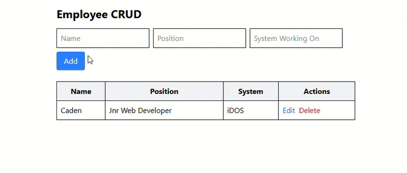

# React + Laravel CRUD App

This is a full-stack CRUD (Create, Read, Update, Delete) application consisting of a **React TypeScript frontend** and a **Laravel backend**.

> The application allows you to manage employees with fields such as name, position, and the system they're working on.

---

## 🌐 Repositories

- **Frontend (React + TypeScript)**:  
  🔗 https://github.com/cadenallied/reactlaravelcrudfrontend

- **Backend (Laravel API)**:  
  🔗 https://github.com/cadenallied/reactlaravelcrud

---

